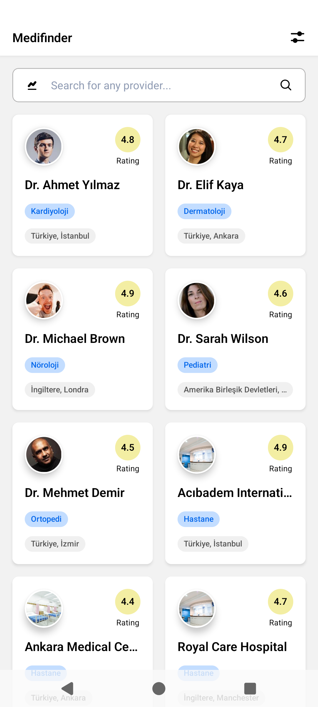
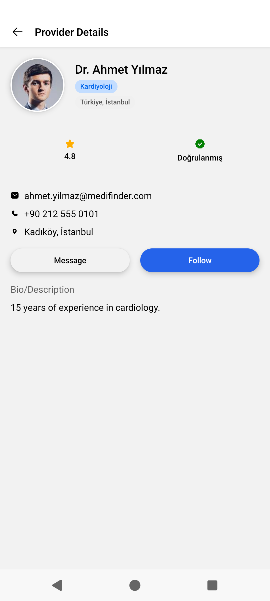
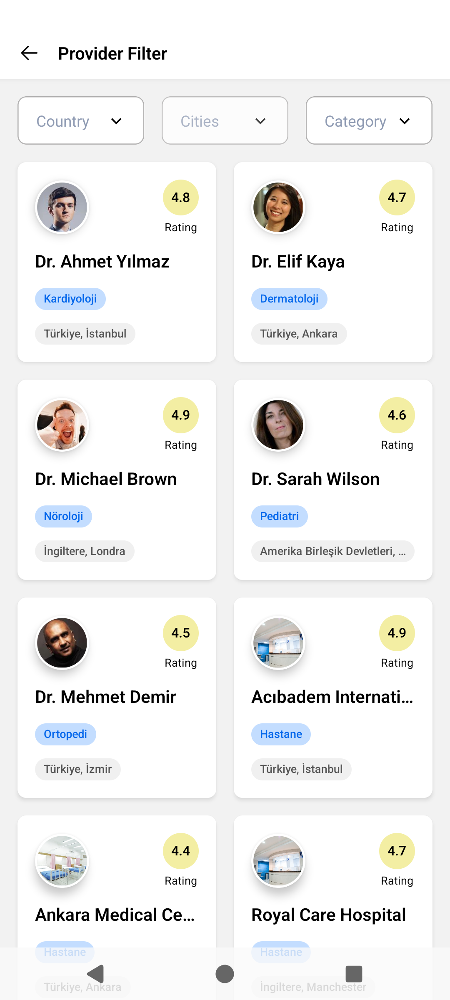
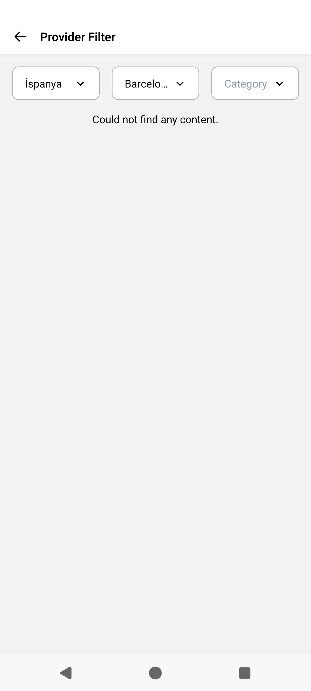
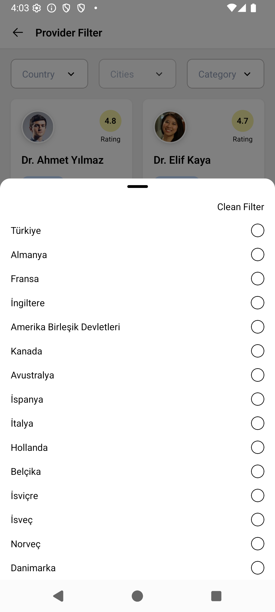
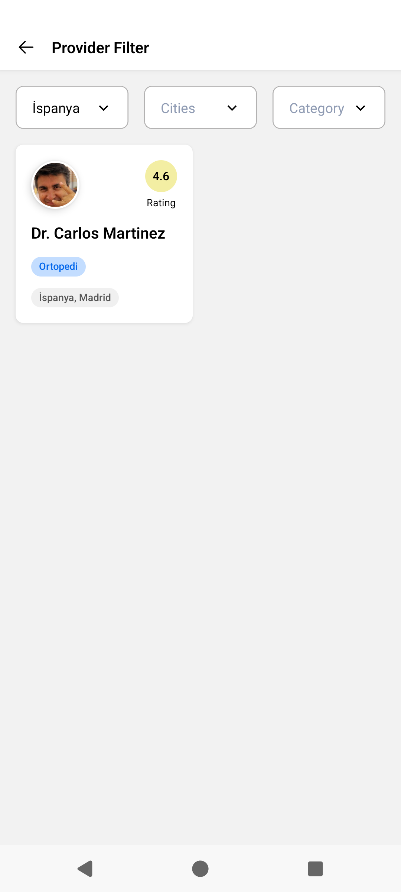

# Medifinder Mobile App

MediFinder, dünya genelinde kullanıcıları güvenilir sağlık profesyonelleri ve sağlık kuruluşlarıyla buluşturan, keşif, etkileşim ve topluluk odaklı yeni nesil bir sağlık platformudur

## 📱 Ekran Görüntüleri

> ⚠️ Video ./screenshots/kayit.mp4 dosya yolundadır ve drive'dan da ulaşabilirsiniz.
> [Video İçin Tıklayınız](https://drive.google.com/file/d/1MjxNqm7VtH-PZTcp8krzIeG5Of2Fe5T1/view?usp=sharing)








## 🚀 Teknolojiler

- **Frontend**:

  - React Native 0.85.3
  - React 19.2.3
  - TypeScript

- **Durum Yönetimi**:

  - TanStack Query (@tanstack/react-query)
  - useState

- **Navigasyon**:

  - React Navigation
    - @react-navigation/native
    - @react-navigation/native-stack

- **Form İşlemleri**:

  - React Hook Form (react-hook-form)
  - Zod (zod)
  - @hookform/resolvers

- **UI Bileşenleri**:

  - React Native StyleSheet (react-native-css-interop)
  - React Native SVG (react-native-svg)
  - Bottom Sheet (@gorhom/bottom-sheet)

- **Custom Bileşenler**:

  - `AppAvatar`, `AppBadge`, `AppIcon`, `AppLoading`, `AppText`, — tekrar kullanılabilir temel component'leri
  - `AppBottomSheetSelect`, `AppInput` — tekrar kullanılabilir form component'leri
  - `AppBar`, `AppError`, `HorizontalLayout` — tekrar kullanılabilir layout'lar

## ⚙️ Kurulum

> ⚠️ Mac cihazım bulunmadığı için bu proje şu an yalnızca **Android** tarafını desteklemektedir.

```bash
# Repoyu klonlayın
git clone https://github.com/omer-akkoca/medifinder.git
cd medifinder

# Bağımlılıkları yükleyin
npm install

# Android için
npm run android:clean
npm run android
```

## 🌟 Özellikler

- **Provider List**:

  - Provider'ları çekme ve listeleme
  - Arama input'u ile provider filreleme

- **Provider Filter**:

  - Provider'ları çekme ve listeleme
  - Ülke seçimine göre provider'ları filreleme
  - Seçilen ülkenin seçilen şehrine göre provider'ları filreleme
  - Branş / kategori'ye göre provider'ları filreleme

- **Provider Detay**:

  - Provider'ın temel profil bilgileri gösterme
  - Provider'ın iletişim bilgilerini gösterme
  - Provider'ın kısa açıklama / bio'sunu gösterme

## 📁 Proje Yapısı

```
ios/            # iOS spesifik native kodlar
android/        # Android spesifik native kodlar
src/
  ├── actions/      # Api isteklerinin yönetilmesi
  │   └── providerActions.ts        # provider istekleri için tanstack yapıları
  │
  ├── components/       # Yeniden kullanılabilir UI componentler
  │   ├── app/              # Uygulama özelindeki componentler
  │   │   └── ProviderCard.tsx      # Provider listeleme card
  │   │
  │   ├── form/     # Form eleman componentleri
  │   │   ├── AppBottomSheetSelect.tsx      # Bottom Sheet ile eleman seçme componenti
  │   │   └── AppInput.tsx                  # Input componenti
  │   │
  │   ├── layouts/                      # Temel yapılar
  │   │   ├── AppBar.tsx                # Sayfa içi kullanılan AppBar
  │   │   ├── AppError.tsx              # Hata gösterme ve refetch etme
  │   │   └── HorizontalLayout.tsx      # Yan yana eleman listeleme
  │   │
  │   └── ui/       # İş arayan ekranları
  │       ├── AppAvatar.tsx         # Provider görsellerini gösterme
  │       ├── AppBadge.tsx          # Badge şeklindeki bilgileri gösterme
  │       ├── AppButton.tsx         # Variant'a (primary veya secondary) buton gösterme
  │       ├── AppIcon.tsx           # Iconları gösterme
  │       ├── AppIconButton.tsx     # Icon butonları gösterme ve tıklama alanı büyütme
  │       └── AppText.tsx           # Uygulamadaki yazıları tek yerden yönetme
  │
  ├── constants/        # Sabit değerler
  │   ├── categories.ts     # dummy category data
  │   ├── cities.ts         # dummy city data
  │   ├── countries.ts      # dummy country data
  │   └── responsive.ts     # Tüm ölçüleri yönetme ve responsive design için ölçülendirme
  │
  ├── hooks/          # Özel React Hook'ları
  │   └── useDebounce.ts        # Veri değiştiği sürece son değişiminden 500ms sonra güncelle
  │
  ├── navigation/       # Navigasyon yapısı ve routelar
  │   ├── AppNavigation.tsx     # Uygulama Stack Navigation
  │   └── types.ts              # Navigation type'ları
  |
  ├── providers/        # Providers yönetimi App.tsx sadeleştirme
  │
  ├── screens/      # Uygulamadaki tüm ekranlar
  │   └── app/      # Uygulama auth flow var ise sadece logged in user'ın girebileceği sayfalar
  │       ├── ProviderDetails/      # Provider Detay Sayfası
  │       │   └── ProviderDetails.tsx
  │       ├── ProviderFilter/       # Provider Filtreleme Sayfası
  │       │    └── ProviderFilter.tsx
  │       ├── ProviderList/         # Provider Listeleme ve search etme sayfası
  │       │    └── ProviderList.tsx
  │       └── @validations.ts       # sayfalar için form validation'ları
  │
  ├── services/       # API istekleri
  │   └── providerService.ts        # provider api istekleri
  │
  ├── types/        # TypeScript tip tanımlamaları
  │   ├── common.ts         # genel type'lar
  │   ├── components.ts     # component'lerin type'ları
  │   ├── params.ts         # atılan isteklerin type'ları
  │   └── providers.ts      # provider type'ları
  │
  └── utils/        # Yardımcı fonksiyonlar
      └── data.ts       # dummy data'lardan ui için uygun label'ları çekme yönetimi

  .env.example      # api keylerin adları
  data.json     # dummy provider data
```

### </> Kod Standartları

1. **Dosya İsimlendirme**:

   - Komponentler: PascalCase (örn: `LoginScreen.tsx`)
   - Yardımcı fonksiyonlar: camelCase (örn: `formatDate.ts`)
   - Hook'lar: camelCase ve "use" prefix'i (örn: `useAuth.ts`)

2. **Komponent Yapısı**:

   ```typescript
   // 1. Importlar
   import React from 'react';
   import { AppText } from '@/src/components';

   // 2. Tip tanımlamaları
   interface Props {
     // ...
   }

   // 3. Komponent
   export const Component: React.FC<Props> = ({ ... }) => {
     // 4. State ve hooks
     const [state, setState] = useState();

     // 5. Yardımcı fonksiyonlar
     const handleAction = () => {
       // ...
     };

     // 6. Render
     return (
       // ...
     );
   };
   ```

3. **Hook'lar**:

   - Her hook kendi dosyasında olmalı
   - "use" prefix'i kullanılmalı

4. **Tip Güvenliği**:

   - Tüm fonksiyonlar ve değişkenler için tip tanımlaması yapılmalı
   - `any` kullanımından kaçınılmalı
   - Interface'ler tercih edilmeli

5. **Performans**:

   - Gereksiz render'lardan kaçınılmalı
   - `useMemo` ve `useCallback` kullanımına dikkat edilmeli
